# Action-Recognition

## Objective
Given a Video containing Human body Motion you have to recognize the action agent is performing.

## Solution Approaches
We started with Action Recognition from skeleton estimates of Human Body. 
Given 3D ground truth coordinates of Human Body (obtained from Kinect Cameras) we tried to use LSTMS as well as Temporal Convolutions for learning skeleton representation of Human Activity Recognition.

We also tried fancier LSTMs as well where we projected the 3D coordinates onto x-y plane, y-z plane, z-x plane followed by 1D convolutions and subsequently adding the outputs of the 4 LSTMs (x-y, y-z, z-x, 3D). Additionally we tried variants where we chose three out of the four LSTMs and compared performance among different projections.

Then we moved to Action Recognition from Videos. We used pretrained Hourglass Network to estimate joints at each frame in videos and used similar LSTMs to perform the task of Action Recognition.

## Dataset
We have used (NTU-RGBD Action)(https://github.com/shahroudy/NTURGB-D) dataset in this project.
It consists of 60 classes of various Human Activities and consist of 56,880 action samples. Of these 60 classes we removed the last 11 classes consisting of multiple people. 
We trained most our models on subsets of this dataset consisting of

| Action            															| label Id      |
| -------------     															|:-------------:|
| drink water       															| 0             |
| throw            	 															| 1             |
| tear up paper     															| 2             |
| take off glasses  															| 3             |
| put something inside pocket / take out something from pocket 					| 4             |
| pointing to something with finger 											| 5             |
| wipe face 																	| 6             |
| falling 																		| 7             |

or 

| Action            | label Id      |
| -------------     |:-------------:|
| drink water       | 0             |
| wear jacket       | 1             |
| Handwaving     	| 2             |
| Kick something  	| 3             |
| salute 			| 4             |

We have also trained a some models on the complete dataset using 49 classes.

## Pipeline
The input is a sequence of frames (i.e video) which first passes through a trained model [available here](https://github.com/xingyizhou/pytorch-pose-hg-3d).
This produces the estmates for the pose in 3D, this 3D pose passes through our network (which takes it various projections) and is used as the main features to classify the action from the above 8 categories.

  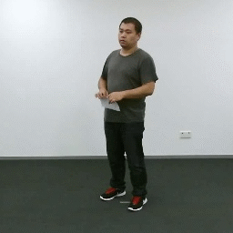

  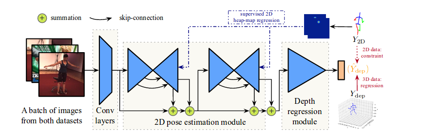

| 2d            | 3d      |
| -------------     |:-------------:|
| 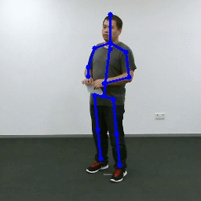      | 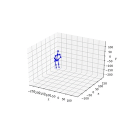           |
   

`predicted action : tear up paper`
(check the load_testbed in notebook to verify this example)

  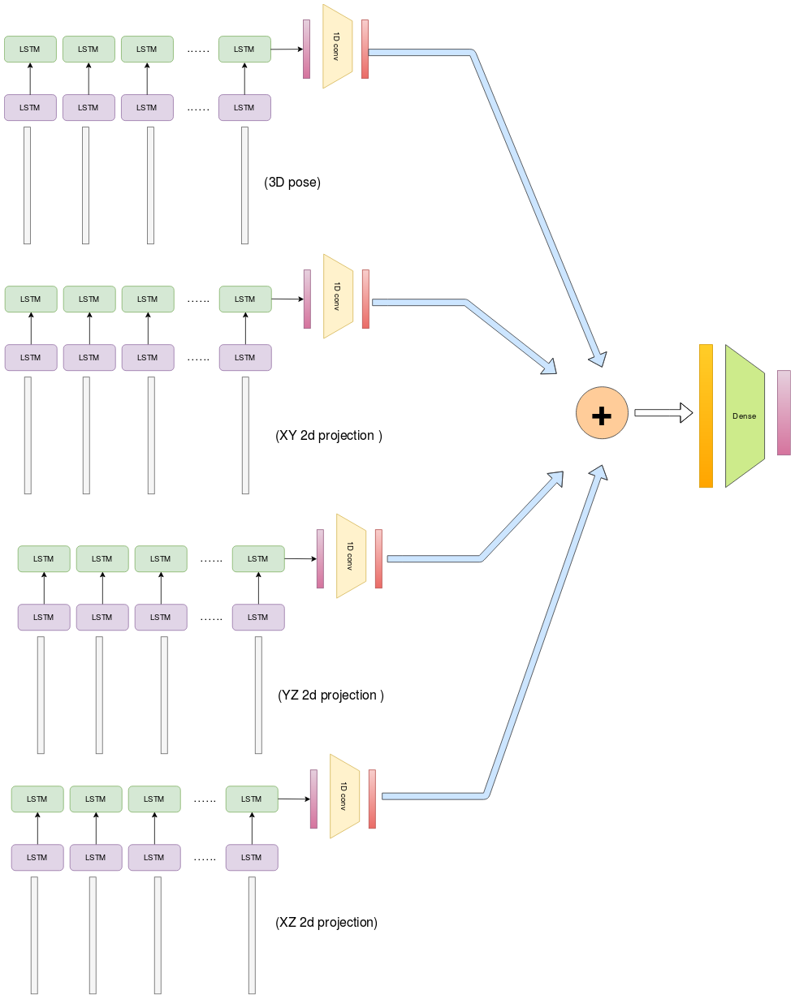

We also tried many different variations for our classifier model, which includes simple 2 layered LSTM network, another type of variation included LSTM models based on only some of the 2d projection of the pose (say XY or YZ or ZX) etc.

## Some Results

|						Data 				    |	Classifier									|    Results  (Accuracy) (val%, train%)		|
|-----------------------------------------------|-----------------------------------------------|-------------------------------|
| Ground-Truth-Skeleton - 5 classes				|	Single LSTM, 3D coordinates					|	75.5%, 79.5%   				|
| Ground-Truth-Skeleton - 5 classes				|	2-Stacked LSTMs, 3D coordinates 			| 	77.1%, 80.4%  				|
| Ground-Truth-Skeleton - 5 classes				|	3-Stacked LSTMs, 3D coordinates 			| 	77.2%, 85.6%  				|
| Ground-Truth-Skeletons - 49 classes			|	2-Stacked LSTMs, 3D coordinates				|	59.7%, 72.5%				|
| Hourglass-Predicted-Skeletons - 8 classes		|	2-Stacked LSTMs, 3D coordinates				|	81.25% 						|
| Hourglass-Predicted-Skeletons - 8 classes		|	2D + 3D Projection LSTMs + 1D conv + fusion	|	82.57% 						|
| Hourglass-Predicted-Skeletons - 8 classes		|	All 2D Projection LSTMs + 1D conv + fusion	|	64.23% 						|
| Hourglass-Predicted-Skeletons - 8 classes		|   X-Y projection only + 1D conv 				|	75.36%						|
| Hourglass-Predicted-Skeletons - 8 classes		|   Y-Z projection only + 1D conv 				|	72.94%						|
| Hourglass-Predicted-Skeletons - 8 classes		|   Z-Y projection only + 1D conv 				|	73.86%						|

For the above mentioned 8 classes, some of the top accuracies models and their learning curve is shown below. Note that some of the models are not fully trained and will possibly score higher if training is completed.

 
	 
<b> Here are the plots of the losses and accuracies of some of the best models</b>
 
 

* <i>3D+2D projections LSTMS (82.7% accuracy)</i>				

  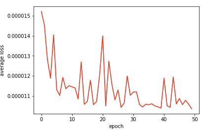
  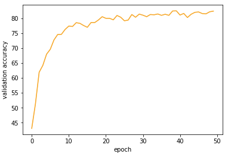

* <i>all 2D projections (64.23% accuracy)</i>

  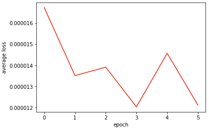
  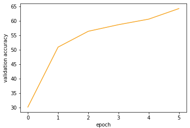

* <i>Simple 2-Stacked LSTM (81.25% accuracy)</i>

  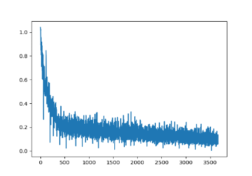
  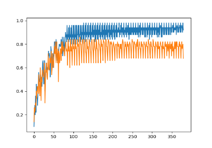

* <i>Simple 2-Stacked LSTM on entire data (59.7% accuracy)</i>

  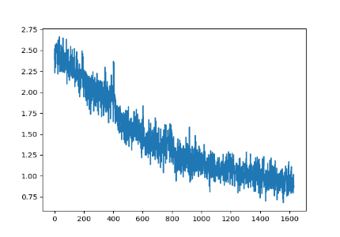
  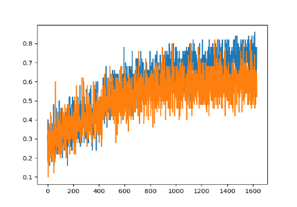

## Requirements 
Kindly use the requirements.txt to set up your machine for replicating this experiment. 

## Instructions
To train the models run `python LSTM_classifierX3cuda<one_of_model_names>.py` in the src folder. This will start the training for 50 epochs and keep saving the best and the last model so far along with the accuracy and loss results in `tr_models` and `outputs` respectively. 

## References
For the purpose of this experiment to get the poses from the the images and videos we are using the awesome repository @
[https://github.com/xingyizhou/pytorch-pose-hg-3d](https://github.com/xingyizhou/pytorch-pose-hg-3d)

